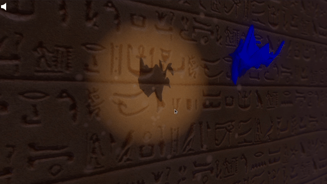

# In-the-shadows

This is a simple demo where the goal is to the find the right shape with shadows. Made with [Godot](https://godotengine.org/).

## Build/Download  

This project can be build with [Godot 3.2.3](https://godotengine.org/download)  
Or you can download a release [here](https://github.com/guilhemSmith/in-the-shadow/releases).

## Controls

| input                 | effect                                         |
| --------------------- | ---------------------------------------------- |
| <kbd>left-click</kbd> | select object or keep pressed to rotate object |
| <kbd>alt</kbd>        | rotation on another axe                        |
| <kbd>shift</kbd>      | translate object                               |

